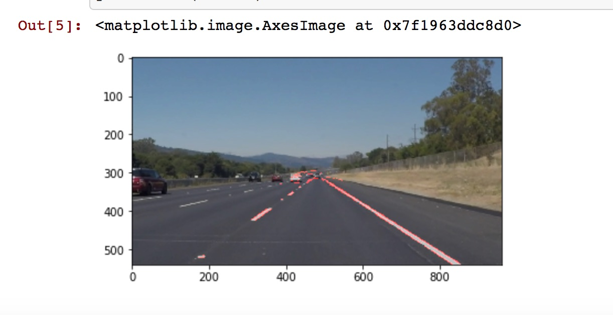

# **Finding Lane Lines on the Road** 

## Writeup Template

### You can use this file as a template for your writeup if you want to submit it as a markdown file. But feel free to use some other method and submit a pdf if you prefer.

---

**Finding Lane Lines on the Road**

The goals / steps of this project are the following:
* Make a pipeline that finds lane lines on the road
* Reflect on your work in a written report

[//]: # (Image References)

[image1]: ./examples/grayscale.jpg "Grayscale"

---

### Reflection

### 1. Describe your pipeline. As part of the description, explain how you modified the draw_lines() function.

My pipeline consisted of 7 steps:
- convert colored image to grayed image
- smooth the conversion using Guassian smooth function, based on gray image from previous step
- identify edges (array of dots) using Canny Edge function, output an image with only edges
- mask the image with region of interest
- conduct `Hough transform` to form lines out of the edges within the region of interest
- merge the original image with the Hough lines based image above
- save the image in the pointed directory.

You can see the output image here:

### 2. Identify potential shortcomings with your current pipeline

One potential shortcoming would be what would happen when the image is invalid. Right now if we accidentally import a PDF file rather than JPG, the pipeline will error out.

Another shortcoming could be we are restricted to only one type of polygon mask, and I'm not sure if the four-sided polyn is *always* the best region mask for lane detection.

Another shortcoming is the parameters for some helper functions are static (e.g. the kernel size of Guassian function, and "rho, theta, threshold, min_line_len, max_line_gap" for Hough transformation)

### 3. Suggest possible improvements to your pipeline

A possible improvement would be to use different type of polygon to mask image to see if we can improve lane detection within the camera sight. We can also try to be smart about what polygon mask to use depending on the road condition, which may be avaialble by detecting color ratio within a picture.

Another possible improvement would be to use a configuration file for the parameters for differnt helper functions so that it's easier to tweak then from outside of the program.
